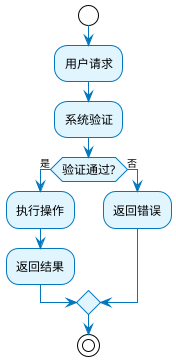
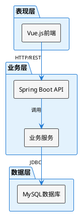
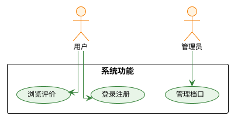
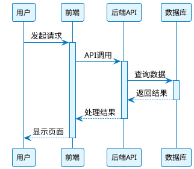

# 07 UML图表生成

## 路径规范
projectRoot 取当前工作目录（pwd）的绝对路径

## 功能说明
自动扫描pngs目录下的JSON文件，基于content内容和源码分析生成对应的UML图表，使用luban-uml工具将PlantUML源码渲染为图片，并按照imagePath或imagePathSequence字段指定的路径进行命名。支持批量处理所有非ER图和非实现图的UML图表。

## 目标任务
1. **JSON文件扫描**：扫描 `<projectRoot>/pngs/` 目录下的所有JSON文件
2. **图表类型识别**：根据文件名、content内容和图片路径字段识别图表类型：
   - `activity-*`：活动图/流程图（处理imagePath字段）
   - `sequence-*`：时序图（处理imagePathSequence字段）
   - `software-architecture`：架构图
   - `system-function-*`：系统功能图
   - `usecase-*`：用例图
   - `er-overview`：ER关系图（跳过，已生成）
   - `entity-*`：单体实体图（跳过，已生成）
   - `implementation-*`：实现图（跳过，不是UML图表）
3. **双图片字段支持**：对于第4章详细设计，同时处理imagePath（活动图）和imagePathSequence（时序图）
4. **批量处理模式**：类似chapter-batch-processor，支持全量扫描和批处理所有符合条件的UML图表
5. **PlantUML源码生成**：基于content内容和源码分析生成清晰有序的PlantUML语法
6. **图片渲染**：使用luban-uml工具将PlantUML渲染为PNG/SVG格式
7. **文件命名**：按照imagePath或imagePathSequence字段的文件名进行输出命名

## 输入要求
- **JSON目录**：`<projectRoot>/pngs/`
- **源码目录**：`<projectRoot>/source/` （AI自动分析项目技术栈和架构）

## 输出结构

### 1. 图片文件输出
- **存放路径**：`<projectRoot>/paper/pngs/`
- **文件命名**：按照JSON文件中imagePath字段的basename命名
- **文件格式**：PNG或SVG（默认PNG）

### 2. PlantUML源码保存
- **存放路径**：`<projectRoot>/paper/pngs/plantuml/`
- **文件命名**：`{图表名}.puml`
- **用途**：便于后续修改和维护

### 3. 生成报告（stdout单行JSON）
```json
{
  "status": "success",
  "project": "<projectName>",
  "inputDir": "<projectRoot>/pngs/",
  "outputDir": "<projectRoot>/paper/pngs/",
  "processedCount": 12,
  "skippedCount": 5,
  "generatedImages": [
    {"file": "activity-user-auth.json", "output": "activity-user-auth.png", "type": "activity"},
    {"file": "software-architecture.json", "output": "software-architecture.png", "type": "architecture"}
  ],
  "skippedFiles": [
    {"file": "entity-users.json", "reason": "单体实体图已存在"},
    {"file": "er-overview.json", "reason": "ER图已生成"},
    {"file": "implementation-user-auth.json", "reason": "实现图不是UML图表"}
  ],
  "failedFiles": [
    {"file": "some-file.json", "reason": "PlantUML语法错误", "error": "..."}
  ]
}
```

### 4. 人类可读处理报告
- 扫描到的JSON文件总数
- 按图表类型分类的文件列表
- 成功生成的图片清单（文件名 → 输出路径）
- 跳过的文件及原因（ER图、实体图、实现图等）
- 失败的文件及错误信息
- PlantUML源码保存位置
- 下一步建议

## 图表类型与PlantUML模板映射

### Activity Diagram（活动图）
**适用文件**：`activity-*.json`
**PlantUML模板**：


### Architecture Diagram（架构图）
**适用文件**：`software-architecture.json`、`system-function-*.json`
**PlantUML模板**：


### Use Case Diagram（用例图）
**适用文件**：`usecase-*.json`
**PlantUML模板**：


### Sequence Diagram（时序图）
**适用文件**：处理imagePathSequence字段的详细设计图
**PlantUML模板**：



## 智能源码分析

### AI自主分析原则
- **无预设限制**：不限制具体的技术栈（Java、Python、Node.js等）
- **自动识别**：AI根据源码结构自动识别项目架构和技术选型
- **内容驱动**：主要基于JSON中的content描述，源码作为辅助验证
- **灵活适应**：根据实际项目情况灵活生成对应的UML图表

## PlantUML生成规则

### 内容处理原则
1. **基于真实源码**：PlantUML内容必须反映实际的代码结构
2. **结合content描述**：以JSON中的content字段为业务描述基础
3. **保持简洁清晰**：避免过于复杂的图表，突出核心流程
4. **统一样式**：使用一致的PlantUML样式和主题

### 命名规范
- **类名**：使用源码中的实际类名
- **方法名**：使用实际的方法签名
- **流程节点**：基于content中的业务描述
- **参与者**：使用系统中的实际角色

### 颜色和样式规范
- **活动图**：蓝色系（#E1F5FE背景，#0277BD边框）
- **架构图**：中性色（白色背景，矩形组件）
- **用例图**：绿色系（#E8F5E8背景，#2E7D32边框）
- **时序图**：蓝色系（#E1F5FE背景，#0277BD箭头和边框）
- **类图**：紫色系（#F3E5F5背景，#7B1FA2边框）

### 图表清晰度要求
- **直线布局**：优先使用直线连接，避免弯曲和混乱的布线
- **对齐排列**：元素按网格对齐，保持整齐的视觉效果
- **简洁明了**：避免过多装饰，突出核心信息和流程
- **统一间距**：保持一致的元素间距和边距
- **清晰标签**：使用简洁明确的标签和说明文字

## 执行流程

### Phase 1: 批量扫描与分类
1. **全量扫描**：递归扫描pngs目录下所有JSON文件
2. **字段解析**：读取每个文件的content、imagePath和imagePathSequence字段
3. **类型识别**：根据文件名模式自动识别图表类型
4. **智能过滤**：排除entity-*、er-overview和implementation-*类型
5. **分批组织**：将符合条件的文件按类型分组，准备批处理

### Phase 2: 源码智能分析
1. **技术栈识别**：AI自主分析source目录结构和技术选型
2. **架构理解**：理解项目的整体架构和组件关系
3. **业务映射**：结合content描述理解业务需求和流程
4. **关系推断**：智能推断图表中的核心要素和相互关系

### Phase 3: 批量PlantUML生成
1. **模板选择**：根据图表类型选择对应的清晰化模板
2. **内容生成**：结合content描述和源码信息生成PlantUML源码
3. **样式优化**：应用直线布局和清晰度要求
4. **双图支持**：对第4章详细设计同时生成活动图和时序图
5. **批量保存**：将所有PlantUML源码保存到plantuml目录

### Phase 4: 批量图片渲染
1. **并行渲染**：使用luban-uml工具批量渲染PNG/SVG格式
2. **智能命名**：按照imagePath或imagePathSequence字段指定的文件名保存
3. **质量检查**：验证生成图片的完整性和清晰度
4. **报告生成**：生成详细的处理报告和统计信息

### Phase 5: 结果整理与反馈
1. **文件统计**：统计处理成功、失败和跳过的文件数量
2. **错误处理**：记录和分析处理失败的原因
3. **质量评估**：检查生成图表的视觉效果和信息完整性
4. **建议输出**：提供后续改进和调整的建议

## 容错机制
- **文件不存在**：跳过并记录到skippedFiles
- **PlantUML语法错误**：记录错误信息，继续处理其他文件
- **渲染失败**：重试一次，失败则记录到failedFiles
- **输出目录不存在**：自动创建目录结构

## 使用场景
- 论文图表自动化生成
- 系统设计文档可视化
- 代码架构图自动生成
- 技术文档图表更新

## 前置条件
- 执行前确保在项目根目录下运行
- pngs目录存在且包含JSON文件
- source目录包含源码文件
- 网络连接正常（PlantUML在线服务）

## 批量处理实现

### 类似chapter-batch-processor的批处理架构
采用类似chapter-batch-processor的设计模式，实现UML图表的智能批量生成：

1. **文件发现与分组**：
   - 扫描pngs目录，按图表类型自动分组
   - 识别双图字段（imagePath + imagePathSequence）
   - 过滤排除ER图和实现图

2. **批处理队列管理**：
   - 按依赖关系排序处理顺序
   - 并行处理无依赖的图表类型
   - 实时监控处理进度和错误状态

3. **智能错误恢复**：
   - 失败重试机制（最多3次）
   - 部分失败继续处理机制
   - 详细错误日志和诊断信息

4. **进度反馈与报告**：
   - 实时显示处理进度百分比
   - 生成详细的成功/失败统计报告
   - 提供后续调整建议

### 批处理命令示例
```bash
# 批量生成所有UML图表
./uml-batch-generator.sh

# 仅生成特定类型图表
./uml-batch-generator.sh --type activity,sequence,usecase

# 重新生成失败的图表
./uml-batch-generator.sh --retry-failed

# 清理并重新生成所有图表
./uml-batch-generator.sh --clean --regenerate
```

## 下一步流程
生成完成后，可以：
1. 将图片嵌入到论文文档中
2. 使用thesis-to-docx工具生成完整的Word文档
3. 根据需要调整PlantUML源码重新生成
4. 使用批处理模式定期更新所有图表